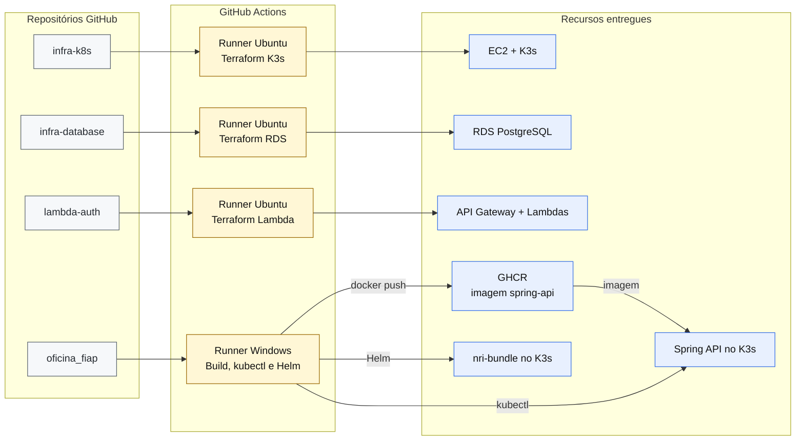

# Visão arquitetural, implantação e CI/CD — Oficina FIAP — Fase 3

Este documento complementa o [Diagrama de Componentes UML](diagrama-componentes-uml.md) com duas visões operacionais: execução da solução e provisionamento/deploy.

## Visão 1 — Componentes em execução

O fluxo principal segue da esquerda para a direita. As setas verdes representam apenas a telemetria enviada ao New Relic.

```mermaid
flowchart LR
    usuario["Cliente"]

    subgraph aws["AWS Cloud"]
        direction LR
        gateway["Amazon API Gateway"]
        authorizer["Lambda Authorizer<br/>valida JWT"]
        proxy["Integração HTTP Proxy"]

        subgraph vpc["VPC padrão"]
            direction LR
            lambdaCpf["Lambda CPF<br/>consulta cliente e emite JWT"]
            rds[("RDS PostgreSQL 16<br/>privado")]

            subgraph ec2["EC2 — K3s"]
                direction LR
                endpoint["APP_BASE_URL<br/>exposição HTTP"]

                subgraph oficina["Namespace of-fiap"]
                    direction TB
                    service["Service spring-api<br/>ClusterIP :8080"]
                    api["Spring API<br/>Deployment com 2 pods"]
                    operacao["HPA 1–3 réplicas<br/>Liveness e Readiness"]
                    prometheus["Actuator / Prometheus<br/>porta 8081"]

                    service --> api
                    operacao -.-> api
                    api --> prometheus
                end

                subgraph agentes["Namespace newrelic"]
                    nri["nri-bundle<br/>Kubernetes, logs e Prometheus"]
                end

                endpoint --> service
                prometheus -->|"coleta"| nri
            end
        end

        gateway -->|"POST /auth/cpf"| lambdaCpf
        lambdaCpf -->|"JDBC"| rds
        gateway -->|"rota protegida"| authorizer
        authorizer -->|"Allow"| proxy
        proxy --> endpoint
        api -->|"JDBC"| rds
    end

    newRelic["New Relic Cloud<br/>Traces, logs, métricas,<br/>dashboards e alertas"]

    usuario -->|"HTTPS"| gateway
    api ==>|"traces OTLP"| newRelic
    nri ==>|"logs e métricas"| newRelic

    classDef pessoa fill:#f6f8fa,stroke:#57606a,color:#24292f;
    classDef awsService fill:#fff0d5,stroke:#d97706,color:#111;
    classDef kubernetes fill:#e8f0fe,stroke:#326ce5,color:#111;
    classDef observability fill:#e9f7ef,stroke:#1f8f4e,color:#111;
    classDef data fill:#eee8fa,stroke:#6f42c1,color:#111;

    class usuario pessoa;
    class gateway,authorizer,proxy,lambdaCpf,endpoint awsService;
    class service,api,operacao,prometheus,nri kubernetes;
    class rds data;
    class newRelic observability;
```

## Visão 2 — Provisionamento e deploy

Cada repositório aponta apenas para sua própria pipeline e para os recursos que ela administra.

## Responsabilidade por repositório

| Repositório | Responsabilidade |
|---|---|
| `oficina_fiap` | API Spring Boot, imagem Docker, manifests Kubernetes, métricas, logs, traces e deploy da aplicação com `kubectl` e Helm |
| `oficina-fiap-infra-k8s` | Provisionamento da instância EC2, rede, Security Group e instalação do K3s com Terraform |
| `oficina-fiap-infra-database` | Provisionamento do RDS PostgreSQL, subnet group e Security Group com Terraform |
| `oficina-fiap-lambda-auth` | Lambdas de autenticação e autorização, API Gateway e respectivos recursos Terraform |

## Fluxos principais

### Emissão do token

1. O cliente envia o CPF para `POST /auth/cpf` no API Gateway.
2. O API Gateway invoca a Lambda de autenticação.
3. A Lambda consulta o cliente no RDS PostgreSQL.
4. Quando o cliente é válido e está ativo, a Lambda devolve um JWT.

### Consumo das rotas protegidas

1. O cliente chama `/api/{proxy+}` com `Authorization: Bearer <JWT>`.
2. O API Gateway solicita a validação ao Lambda Authorizer.
3. Com a autorização `Allow`, o Gateway encaminha a requisição para `APP_BASE_URL`.
4. A API Spring Boot processa a requisição e acessa o RDS por JDBC.

### Observabilidade

1. A aplicação exporta traces por OpenTelemetry para o endpoint OTLP do New Relic.
2. O `nri-bundle`, instalado por Helm, coleta logs, métricas Prometheus, eventos e consumo de recursos do Kubernetes.
3. O New Relic apresenta dashboards e dispara alertas de falhas no processamento de ordens.

## Observação sobre a exposição da aplicação

O API Gateway exige uma `APP_BASE_URL` alcançável pela AWS. O manifesto atual cria o serviço `spring-api` como `ClusterIP`, que é acessível apenas dentro do cluster. A estratégia definitiva de exposição HTTP — como Ingress, LoadBalancer, NodePort com proxy na porta 80 ou outra alternativa — precisa ser confirmada pelo responsável pela infraestrutura antes da entrega. A ligação entre o API Gateway e o endpoint aparece no diagrama como arquitetura-alvo.
