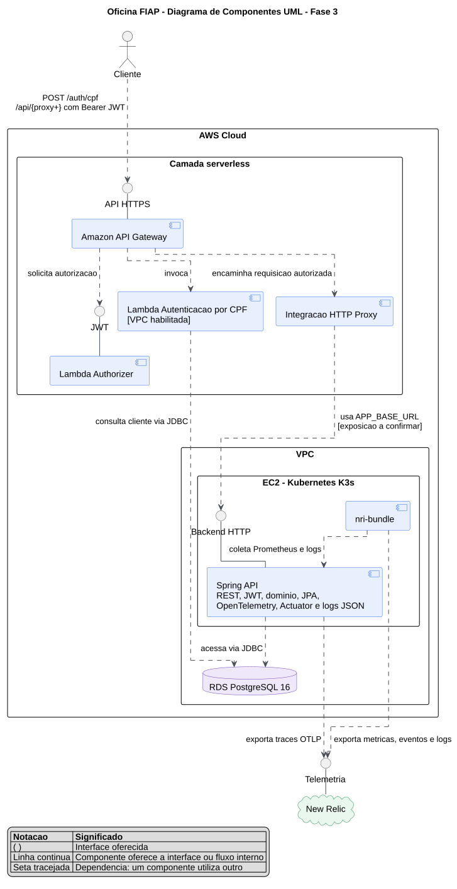

# Diagrama de Componentes UML - Oficina FIAP - Fase 3

Este diagrama apresenta os componentes de software da solução, as interfaces oferecidas e as dependências entre eles. A infraestrutura física, os runners e o processo de deploy estão documentados separadamente na [visão arquitetural, implantação e CI/CD](arquitetura-implantacao-cicd-fase3.md).

O código-fonte editável do diagrama está disponível em [`diagrama-componentes-uml.puml`](diagrama-componentes-uml.puml).

## Como ler

- Os círculos representam interfaces oferecidas pelos componentes.
- As linhas contínuas ligam um componente à interface que ele oferece ou representam um fluxo interno.
- As setas tracejadas representam dependências: o elemento de origem utiliza o elemento de destino.
- Os agrupamentos identificam os componentes serverless, a VPC e o cluster Kubernetes K3s.

## Limite da representação

A dependência entre a integração HTTP Proxy do API Gateway e a interface HTTP da Spring API representa a arquitetura-alvo. Para funcionar no ambiente implantado, `APP_BASE_URL` deve apontar para um endpoint alcançável pelo API Gateway. O Service Kubernetes atual é do tipo `ClusterIP` e, sozinho, não oferece acesso externo; a estratégia de exposição ainda deve ser confirmada pela equipe de infraestrutura.

O `JWT_SECRET` também deve possuir exatamente o mesmo valor na Lambda de autenticação, no Lambda Authorizer e na Spring API.
